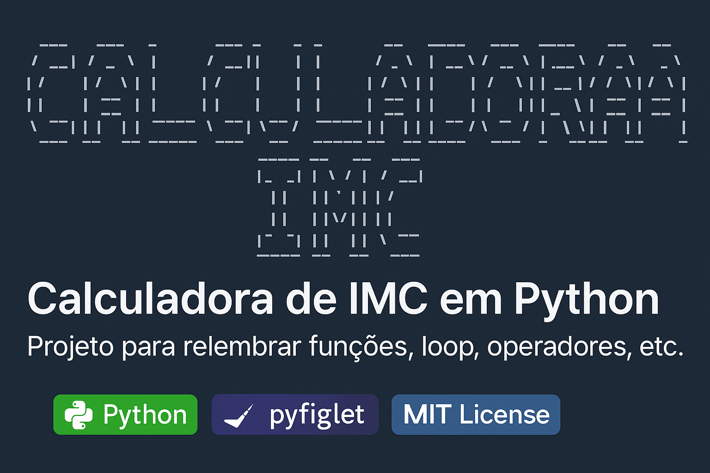

<p align="center">
    
</p>
# 👮 Calculadora de IMC em Python

Projeto simples em Python com o objetivo de **relembrar conceitos fundamentais** da linguagem, como:

- Funções (`def`)
- Laços de repetição (`while`)
- Operadores matemáticos
- Manipulação de strings
- Tratamento de erros com `try/except`
- Uso de bibliotecas externas (`pyfiglet` para ASCII art)

---

## 🌟 Objetivo do Projeto

Este projeto foi criado como forma de **relembrar aprendizados de Python** e praticar conceitos essenciais.  
Como desafio pessoal, também foi adicionado o uso da biblioteca `pyfiglet` para deixar a saída mais personalizada.

---

## ✅ Funcionalidades

- Recebe peso e altura do usuário
- Aceita vírgulas ou pontos como separadores decimais
- Calcula o IMC de forma precisa
- Exibe o valor do IMC com 2 casas decimais
- Classifica o resultado com base nas faixas da OMS
- ASCII Art no título com `pyfiglet`
- Laço que permite repetir o cálculo várias vezes
- Tratamento de erros caso o usuário digite valores inválidos

---

## 💻 Como executar

### Pré-requisitos

- Python 3.6+
- Instalar dependências com [Poetry](https://python-poetry.org/):

```bash
poetry install
```

### Executar:

```bash
poetry run calculadora-imc
```

---

## 💦 Estrutura do projeto

```
calculadora-imc/
├── Calculadora_IMC.py
├── LICENSE
├── pyproject.toml
└── README.md
```

---

## 📦 Dependências

- `pyfiglet` – Para gerar arte ASCII no terminal

Instalado automaticamente via Poetry ou com:

```bash
pip install pyfiglet
```

---

## 📋 Classificação do IMC

| IMC         | Classificação        |
|-------------|----------------------|
| < 18.5      | Abaixo do peso       |
| 18.5 - 24.9 | Peso normal          |
| 25.0 - 29.9 | Sobrepeso            |
| 30.0 - 34.9 | Obesidade grau I     |
| 35.0 - 39.9 | Obesidade grau II    |
| ≥ 40        | Obesidade grau III   |

---

## 📄 Licença

Este projeto está licenciado sob a licença MIT.  
Você pode usar, modificar e distribuir à vontade — apenas mantenha os créditos.

---

## 🤛 Autor

Desenvolvido por **IC4R0** como parte de sua jornada de aprendizado em Python.
